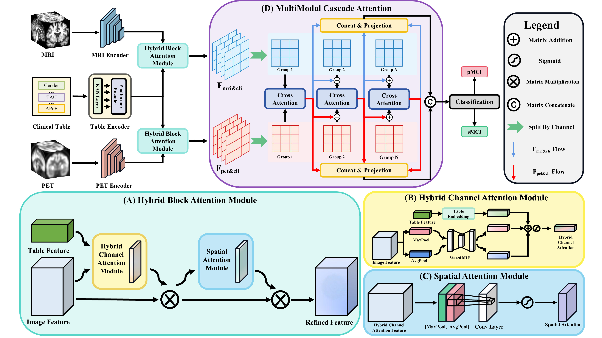

# A Lightweight Triple-Modal Fusion Network for Progressive Mild Cognitive Impairment Prediction in Alzheimer's Disease 


-----


## 1 FrameWork




## 2 Source Tree

```
├── /Net
│   ├── ComparisionNet.py
│   ├── TriLightNet.py
│   ├── __init__.py
│   ├── basic.py
│   ├── defineViT.py
│   ├── kan.py
│   ├── metaformer3D.py
├── /utils
│   ├── __init__.py
│   ├── api.py
│   ├── basic.py
│   ├── observer.py
├── Config.py
├── Dataset.py
├── README.md
├── loss_function.py
├── main_rebuild.py
├── model_object.py
├── model_params.py
```

## 3 Dataset

### 3.1  Introduction

The dataset for this study is obtained from the Alzheimer's Disease Neuroimaging Initiative (ADNI), specifically the ADNI-1 and ADNI-2 cohorts. We merge the ADNI1 and ADNI2 datasets, and it consists of 1109 subjects, including 226 AD, 512 MCI (149 pMCI and 363 sMCI), and 371 CN cases. 

The ADNI dataset link: [ADNI | Alzheimer's Disease Neuroimaging Initiative](https://adni.loni.usc.edu/)

### 3.2 Dataset Split Principle

The dataset is split into training (80%) and testing (20%) subsets. For the training subset, we employ a `5-fold cross-validation` strategy to ensure robust model evaluation. We save the best model from the validation for each 5 fold, and finally test it on the testing set.

## 4 Training Process

### 4.1 Environment Setup

1. Create environment: `conda env create -n TriLightNet --python=3.9`
2. Activate environment: `conda activate TriLightNet`
3. Install environment: `pip install -r requirement.txt`

### 4.2 Hyperparameter setting

- Python Version: `3.9.21`
- PyTorch Version: `2.6.0` with CUDA `11.8`
- GPU: `Nvidia V100 32GB`
- Training: `5-fold cross-validation` (each fold with `150 epochs`)
- Batch size: `8`
- Optimizer: `Adam`
- Learning rate: `0.0001`
- Scheduler: `Cosine Annealing` with `T_max=50`

### 4.3 training step

1. Download and preprocess the ADNI dataset, including MRI, PET, and clinical modalities
2. Place the data in the following folder structure:

```
.
├── /ADNI1/MRI/
│   ├── xx.nii
│   ├── xx.nii
│   └── ....
├── /ADNI1/PET/
│   ├── xx.nii
│   ├── xx.nii
│   └── ...
└── clinical.csv
└── ...
└── ...

```

3. Modify `Config.py` to specify dataset paths.

4. Run the training script:

```shell
python main_rebuild.py
```

## 5 Experimental Result


| Method                 | M    | P    | C    | Accuracy (%) $\pm$  std  | Sensitivity (%) $\pm$  std | Precision (%) $\pm$  std  | AUROC $\pm$  std            | F1-Score (%) $\pm$  std  | Balanced Acc. (%) $\pm$  std | Params (M)    | FLOPs (G)     |
| ---------------------- | ---- | ---- | ---- | ------------------------ | -------------------------- | ------------------------- | --------------------------- | ------------------------ | ---------------------------- | ------------- | ------------- |
| ResNet+Concat          | ✔    | ✔    |      | 73.75 $\pm$ 3.79         | **75.04 $\pm$  9.16**      | 53.81 $\pm$  5.43         | 0.7699 $\pm$  0.0276        | 62.33 $\pm$  4.95        | 73.26 $\pm$  6.15            | 66.952        | 70.924        |
| ViT+Concat             | ✔    | ✔    |      | 71.75 $\pm$  3.12        | 29.09 $\pm$  18.08         | 42.38 $\pm$  22.15        | 0.5523 $\pm$  0.0777        | 33.23 $\pm$  18.82       | 59.12 $\pm$  6.03            | 20.853        | 20.853        |
| nnMamba+Concat         | ✔    | ✔    |      | 73.75 $\pm$  5.04        | 51.31 $\pm$  16.36         | 57.81 $\pm$  9.18         | 0.6978 $\pm$  0.0376        | 51.75 $\pm$  4.10        | 66.71 $\pm$  2.17            | 26.042        | 48.626        |
| Diamond                | ✔    | ✔    |      | <u>77.76 $\pm$  1.72</u> | 48.73 $\pm$  4.09          | 67.13 $\pm$  6.79         | 0.7257 $\pm$  0.0304        | 56.02 $\pm$  1.24        | 69.19 $\pm$  0.72            | 23.504        | 97.638        |
| MDL                    | ✔    | ✔    |      | 71.50 $\pm$  7.39        | 54.51 $\pm$  17.94         | 57.29 $\pm$  13.57        | 0.7130 $\pm$  0.0321        | 51.65 $\pm$  3.54        | 66.44 $\pm$  1.98            | <u>10.707</u> | <u>19.243</u> |
| VAPL                   | ✔    |      | ✔    | 69.25 $\pm$  4.00        | 42.25 $\pm$  15.78         | 48.27 $\pm$  6.03         | 0.6701 $\pm$  0.0680        | 42.92 $\pm$  10.81       | 61.46 $\pm$  5.26            | 63.504        | 40.350        |
| HyperFusionNet         | ✔    |      | ✔    | 75.50 $\pm$  2.69        | 54.24 $\pm$  8.25          | 59.96 $\pm$  6.92         | 0.7330 $\pm$  0.0175        | 56.05 $\pm$  2.76        | 69.20 $\pm$  1.50            | 15.402        | 47.750        |
| IMF                    | ✔    | ✔    | ✔    | 77.75 $\pm$  3.98        | 70.07 $\pm$  9.52          | <u>61.81 $\pm$  10.27</u> | <u>0.7946 $\pm$  0.0316</u> | <u>64.34 $\pm$  2.01</u> | <u>75.39 $\pm$  1.41</u>     | 67.843        | 70.925        |
| HFBsurv                | ✔    | ✔    | ✔    | 75.00 $\pm$  3.26        | 71.73 $\pm$  5.70          | 56.12 $\pm$  5.24         | 0.7552 $\pm$  0.0371        | 62.54 $\pm$  2.17        | 74.10 $\pm$  1.37            | 34.123        | 141.849       |
| ITCFN                  | ✔    | ✔    | ✔    | 75.50 $\pm$  3.76        | 73.31 $\pm$  3.80          | 56.40 $\pm$  6.03         | 0.7750 $\pm$  0.0580        | 63.58 $\pm$  4.44        | 74.87 $\pm$  3.23            | 71.305        | 71.098        |
| MultimodalADNet        | ✔    | ✔    | ✔    | 73.25 $\pm$  4.23        | 63.93 $\pm$  17.73         | 57.77 $\pm$  11.18        | 0.7434 $\pm$  0.0236        | 57.31 $\pm$  3.53        | 70.53 $\pm$  2.62            | **4.320**     | 20.307        |
| **TriLightNet (Ours)** | ✔    | ✔    | ✔    | **81.25 $\pm$  0.93**    | <u>73.91 $\pm$  8.17</u>   | **65.38 $\pm$  2.91**     | **0.8146 $\pm$  0.0029**    | **69.39 $\pm$  3.76**    | **79.06 $\pm$  2.85**        | 17.405        | **10.517**    |


> - In the Modality column, `M`, `P`, and `C` denote MRI, PET, and clinical data.
>
> - ✔ indicates modality used: M = MRI, P = PET, C = Clinical  


