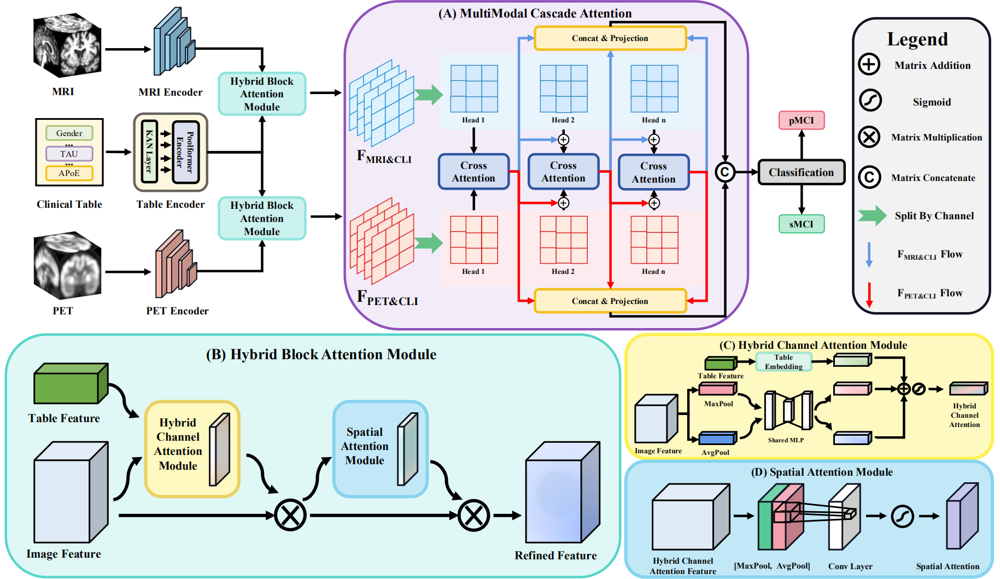

# TriLightNet: A Triple-modal Light Fusion Network for Progressive Mild Cognitive Impairment Detection in Alzheimer’s Disease


-----


## 1 FrameWork




## 2 Source Tree

```
├── /Net
│   ├── ComparisionNet.py
│   ├── TriLightNet.py
│   ├── __init__.py
│   ├── basic.py
│   ├── defineViT.py
│   ├── kan.py
│   ├── metaformer3D.py
├── /utils
│   ├── __init__.py
│   ├── api.py
│   ├── basic.py
│   ├── observer.py
├── Config.py
├── Dataset.py
├── README.md
├── loss_function.py
├── main_rebuild.py
├── model_object.py
├── model_params.py
```

## 3 Dataset

### 3.1  Introduction

The dataset for this study is obtained from the Alzheimer's Disease Neuroimaging Initiative (ADNI), specifically the ADNI-1 and ADNI-2 cohorts. To prevent duplication, subjects present in both datasets were removed from ADNI-2. We selected T1-weighted sMRI, FDG-PET, and clinical data, categorized into four groups: normal controls (NC), sMCI, pMCI, and AD. Demographic information of the dataset is shown in Table below. Additionally, PET data is missing for 82 pMCI and 95 sMCI cases in ADNI-1, and for 1 pMCI and 30 sMCI cases in ADNI-2.

The ADNI dataset link: [ADNI | Alzheimer's Disease Neuroimaging Initiative](https://adni.loni.usc.edu/)

### 3.2 Dataset Split Principle

We employ a `5-fold cross-validation` strategy to ensure robust model evaluation. The dataset is split into training (80%) and validation (20%) subsets, maintaining an equal proportion of each class.

## 4 Training Process

### 4.1 Environment Setup

1. Create environment: `conda env create -n TriLightNet --python=3.9`
2. Activate environment: `conda activate pasta`
3. Install environment: `pip install -r requirement.txt`

### 4.2 Hyperparameter setting

- Python Version: `3.9.21`
- PyTorch Version: `2.6.0` with CUDA `11.8`
- GPU: `Nvidia V100 32GB`
- Training: `Two-stage training` (each stage with `150 epochs`)
- Batch size: `8`
- Optimizer: `Adam`
- Learning rate: `0.0001`
- Scheduler: `Cosine Annealing` with `T_max=50`

### 4.3 training step

1. Download and preprocess the ADNI dataset, including MRI, PET, and clinical modalities
2. Place the data in the following folder structure:

```
.
├── /ADNI1/MRI/
│   ├── xx.nii
│   ├── xx.nii
│   └── ....
├── /ADNI1/PET/
│   ├── xx.nii
│   ├── xx.nii
│   └── ...
└── clinical.csv
└── ...
└── ...

```

3. Modify `Config.py` to specify dataset paths.

4. Run the training script:

```shell
python main_rebuild.py
```

## 5 Experimental Result

> In the Modality column, `M`, `P`, and `C` denote MRI, PET, and clinical data.

1、The comparative experimental results in ADNI1 datasets.

| Method       | Modality | ACC          | PRE          | BACC         | AUC          | F1           |
| ------------ | -------- | ------------ | ------------ | ------------ | ------------ | ------------ |
| HOPE         | M        | 0.611        | 0.599        | 0.699        | 0.648        | 0.593        |
| Resnet       | M,P      | 0.725        | 0.671        | 0.693        | 0.653        | 0.606        |
| JSRL         | M,P      | 0.582        | 0.580        | 0.566        | 0.571        | 0.580        |
| VAPL         | M,C      | 0.630        | 0.621        | 0.628        | 0.635        | 0.651        |
| Diamond      | M,P      | 0.736        | 0.719        | 0.693        | 0.638        | 0.591        |
| HFBSurv      | M,P,C    | 0.740        | 0.701        | 0.714        | 0.711        | 0.630        |
| IMF          | M,P,C    | <u>0.756</u> | 0.740        | 0.710        | 0.720        | 0.605        |
| IHF(w/o CMG) | M,P,C    | **0.781**    | **0.805**    | **0.741**    | **0.747**    | <u>0.658</u> |
| IHF(Ours)    | M,P,C    | 0.737        | <u>0.708</u> | <u>0.723</u> | <u>0.738</u> | **0.666**    |

2、The comparative experimental results in ADNI2 datasets.

| Method       | Modality | ACC          | PRE          | BACC         | AUC          | F1           |
| ------------ | -------- | ------------ | ------------ | ------------ | ------------ | ------------ |
| HOPE         | M        | 0.701        | 0.706        | 0.645        | 0.624        | 0.505        |
| Resnet       | M,P      | 0.809        | 0.721        | 0.683        | 0.709        | 0.510        |
| JSRL         | M,P      | 0.650        | 0.600        | 0.655        | 0.694        | 0.519        |
| VAPL         | M,C      | 0.712        | <u>0.750</u> | 0.672        | 0.623        | 0.561        |
| Diamond      | M,P      | 0.818        | 0.739        | 0.682        | 0.645        | 0.509        |
| HFBSurv      | M,P,C    | 0.813        | 0.701        | 0.688        | 0.672        | 0.539        |
| IMF          | M,P,C    | 0.838        | 0.737        | 0.713        | 0.757        | 0.564        |
| IHF(w/o CMG) | M,P,C    | <u>0.840</u> | 0.722        | <u>0.723</u> | **0.839**    | **0.591**    |
| IHF(Ours)    | M,P,C    | **0.856**    | **0.777**    | **0.735**    | <u>0.812</u> | <u>0.584</u> |


